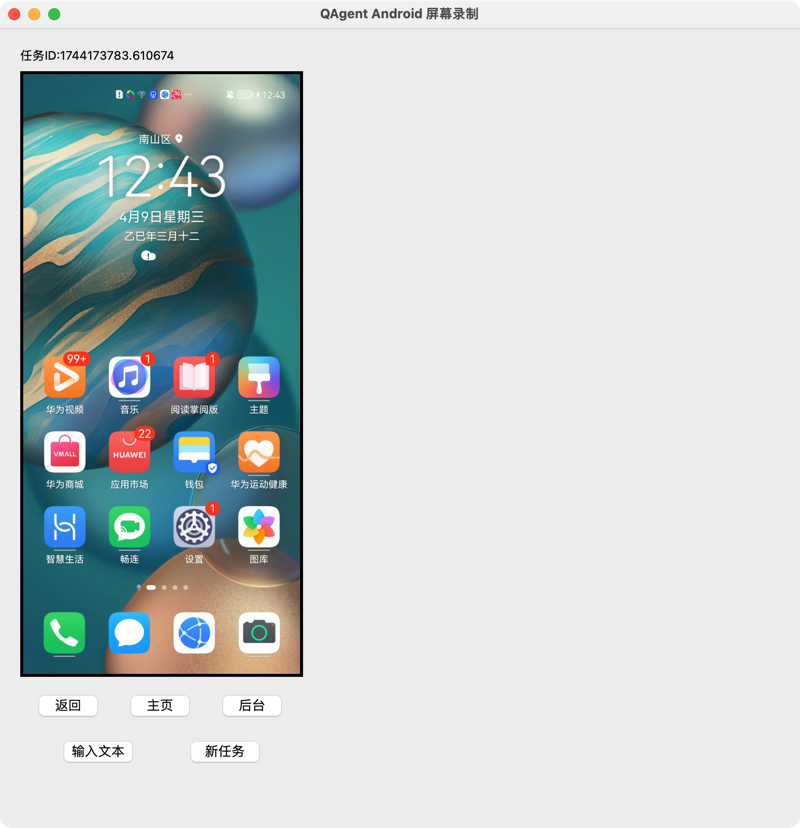

## QAgent-Android-Record: 安卓手机截图、操作和视频录制工具

### 环境安装
* 需要先准备一台android手机, 同时要开启开发者模式，启动USB调试模式，用USB线连接到电脑后，选择`文件传输`.
* 根据自己的系统先安装[git](https://git-scm.com/downloads)
* Windows系统直接下载[安装包](https://drive.weixin.qq.com/s?k=AJEAIQdfAAoXfEg1dM), 然后双击`start.bat`运行。如果闪退，在这个目录的文件夹下命令行输入`.\start.bat`，查看是什么报错。
* 其它系统先下载和安装[uv](https://github.com/astral-sh/uv/releases)， 然后运行`bash start.sh`自动安装环境并运行UI。

### 使用方式
整个UI如下图所示:

* 任务id在UI上方，这个任务id要记住，保存在data下的任务数据也是以这个任务id命名。
* 点击新任务后，会自动保存上一个任务的信息到data文件夹下，同时开始新的任务。
* 所有的操作都需要在电脑屏幕上进行。
* 每个任务都会记录每个操作`screenshot`,`record.mp4`和`actions.json`三个信息。
